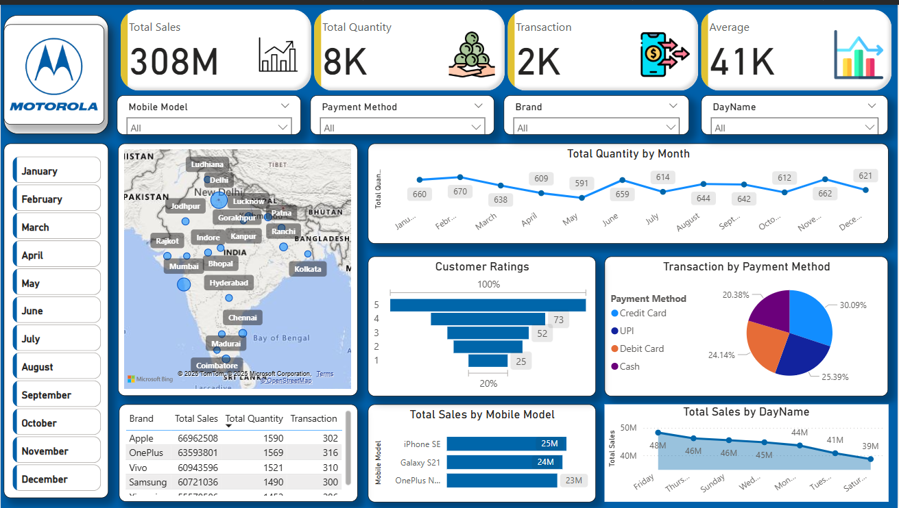
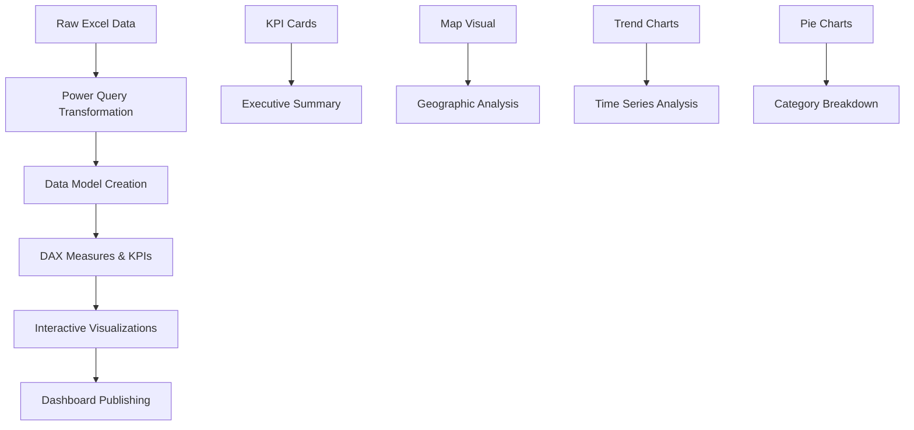

# 📊 Power BI Mobile Sales Dashboard

**📈 Interactive Business Intelligence Dashboard for Mobile Sales Analysis**

[View Dashboard](#-dashboard-preview)  • [Download Data](./Day%20-%2030%20-%20Mobile%20Sales%20Data.xlsx)

---

## 🚀 Project Overview

> **Transforming raw sales data into actionable business insights through interactive visualization**

This comprehensive Power BI dashboard provides a 360° view of mobile sales performance across India, enabling stakeholders to make data-driven decisions through interactive visualizations and dynamic filtering capabilities.

---

## 🎯 Dashboard Preview

### 🔥 **Live Dashboard Features**

| 🎨 Visual Component | 📊 Purpose | 🎯 Business Value |
|---------------------|------------|-------------------|
| **KPI Cards** | Key Performance Metrics | Quick executive summary |
| **Geographic Map** | Sales Distribution | Territory performance analysis |
| **Trend Analysis** | Time-series patterns | Seasonal insights & forecasting |
| **Payment Analytics** | Transaction preferences | Customer behavior understanding |

---

## 💡 Key Performance Indicators

### 📈 **Business Metrics at a Glance**

| KPI | Value | Insight |
|-----|-------|---------|
| 💰 **Total Revenue** | **₹308M+** | Strong market performance |
| 📦 **Units Sold** | **8,000+** | High volume turnover |
| 💳 **Transactions** | **2,000+** | Active customer base |
| 📊 **Avg Transaction Value** | **₹41,000** | Premium product mix |
| 🌍 **City Coverage** | **20+ Cities** | Wide geographical reach |
| ⭐ **Customer Satisfaction** | **5-Star Dominant** | Excellent service quality |

---

## 🔍 Strategic Business Questions Answered

<b>🏆 Product Performance Analysis</b>

- **Which mobile brands drive maximum revenue?**
  - Top performers: iPhone SE, Galaxy S21, OnePlus Nord
  - Brand loyalty patterns and market share analysis
  - Price point optimization opportunities

<b>💳 Customer Payment Behavior</b>

- **What are the preferred payment methods?**
  - Digital payment adoption rates
  - UPI vs Traditional payment preferences
  - Transaction security and convenience factors

<b>🗺️ Geographic Market Analysis</b>

- **Which cities generate highest sales volumes?**
  - Metro vs Tier-2 city performance
  - Regional market penetration
  - Expansion opportunity identification

<b>📅 Temporal Sales Patterns</b>

- **When do sales peak throughout the year?**
  - Seasonal trends and cyclical patterns
  - Festival and holiday impact analysis
  - Inventory planning insights

<b>⭐ Customer Experience Metrics</b>

- **How does customer satisfaction impact sales?**
  - Rating distribution analysis
  - Correlation between ratings and repeat purchases
  - Service quality improvement areas

---

## 🛠️ Technical Implementation

### 📊 **Dashboard Components**

### 🔧 **Technical Skills Demonstrated**

| 💻 Core Competency | 🎯 Application | ⚡ Advanced Features |
|-------------------|----------------|-------------------|
| **DAX Functions** | Custom measures & KPIs | CALCULATE, SUMX, RELATED |
| **Data Modeling** | Relationships & hierarchies | Star schema implementation |
| **Power Query** | ETL processes | Data transformation & cleansing |
| **Visualization** | Interactive charts | Cross-filtering & drill-through |
| **UX Design** | Dashboard layout | Color theory & accessibility |

---

## 📈 Business Impact & Insights

### 🎯 **Key Findings**

> **Market Leadership**: Premium brands (iPhone, Samsung) dominate revenue despite lower unit volumes

> **Digital Transformation**: UPI payments show highest adoption, indicating customer preference for digital transactions

> **Geographic Concentration**: Metro cities contribute 60%+ of total sales, highlighting urban market strength

> **Seasonal Patterns**: Q4 shows peak performance, aligning with festival seasons and year-end purchases

### 🚀 **Actionable Recommendations**

1. **🎯 Market Expansion**: Focus on Tier-2 cities with high growth potential
2. **💳 Payment Innovation**: Enhance digital payment experiences to capture growing UPI trend
3. **📱 Product Strategy**: Optimize premium product mix based on high-value transaction patterns
4. **📅 Inventory Planning**: Align stock levels with identified seasonal demand patterns
5. **⭐ Customer Experience**: Maintain high satisfaction scores through continued service excellence

---

## 🚀 Getting Started

### 📋 **Prerequisites**

- Microsoft Power BI Desktop (Latest Version)
- Excel 2016 or later
- Windows 10/11 Operating System
